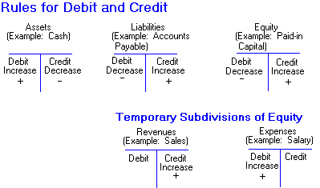

# Backend

> Code without tests is broken as designed. — Jacob Kaplan-Moss

> Software testing is a process used to identify the **correctness, completeness and the quality of developed compute software.** 
It includes a set of activities conducted with intent of **finding errors in software so that it could be corrected before the 
product is released to end users.**
``
> Generally Accepted Accounting Principles (GAAP)

#### Simple rule, do not use any framework at all

### Accounting rule

| Nature   |Real Account|Personal Account|Nominal Account|
|----------|-------------|------|------|
| Debit |what comes in|receiver|All expenses and losses|
| Credit |what goes out|giver|All incomes and profit|
| Applicable |Cash, land and building, furniture|Ram and sons, Bank Account, Outstanding salary, prepaid expenses|Salary, wages, purchase, sales|



#### Read list
- https://lethain.com/introduction-to-architecting-systems-for-scale/#platform_layer

create ledger upfront

profit and loss a/c
cash
purchase
purchase return
sales
sales return

[ERP Features](https://en.wikipedia.org/wiki/Enterprise_resource_planning)
- Financial accounting: general ledger, fixed assets, payables including vouchering, matching and payment, receivables and collections, cash management, financial consolidation
- Management accounting: budgeting, costing, cost management, activity based costing
- Human resources: recruiting, training, rostering, payroll, benefits, retirement and pension plans, diversity management, retirement, separation
- Manufacturing: engineering, bill of materials, work orders, scheduling, capacity, workflow management, quality control, manufacturing process, manufacturing projects, manufacturing flow, product life cycle management
- Order processing: order to cash, order entry, credit checking, pricing, available to promise, inventory, shipping, sales analysis and reporting, sales commissioning
- Supply chain management: supply chain planning, supplier scheduling, product configurator, order to cash, purchasing, inventory, claim processing, warehousing (receiving, putaway, picking and packing)
- Project management: project planning, resource planning, project costing, work breakdown structure, billing, time and expense, performance units, activity management
- Customer relationship management (CRM): sales and marketing, commissions, service, customer contact, call center support – CRM systems are not always considered part of ERP systems but rather business support systems (BSS)
- Data services: various "self–service" interfaces for customers, suppliers and/or employees


Sundry Debtors: person who owes money to the firm because of credit sales of goods 
Sundry Creditors:  person to whom firm is supposed to pay the outstanding amount in future
cash flow = cash ledger + bank ledger

incoming cash - inflow
- capital
- cash received from customer & debtors against sold of goods or services
- other receivable

outgoing cash - outflow
- purchase goods or production
- all direct expenses
- all indirect expenses


kind of cash flow
- positive cash flow
- negative cash flow
- break even cash flow


investment
direct - share
indirect - mutual fund

inventory
https://www.youtube.com/watch?v=ZXTUacR1YAc
https://www.youtube.com/watch?v=ul8FaQUDyPg

StockGroup: type of item eg. shirt, jean, shorts
StockItem: fk to stockgroup eg: lee jean, levis jean  
	- unit
	- tax information
	- opening balance


```bash
./manage.py dumpdata --natural-foreign --natural-primary --indent 4 > fixture/filename.json
./manage.py dumpdata <app_name>.<model_name> --natural-foreign --natural-primary --indent 4 > fixture/filename.json
./manage.py loaddata fixture/filename.json

# Graph

#To group all the application and output into PNG file
$ python manage.py graph_models -a -g -o imagefile_name.png
#Include only some applications
$ python manage.py graph_models app1 app2 -o app1_app2.png
#Include only some specific models
$ python manage.py graph_models -a -I Foo,Bar -o foo_bar.png
#OR exclude certain models 
$ python manage.py graph_models -a X Foo,Bar -o no_foo_bar.png

# Remove all migration file in one command
find . -path "*/migrations/*.py" -not -name "__init__.py" -delete   
find . -path "\*/migrations/\*.pyc"  -delete

```
### commands
```bash
pytest
pytest --pdb # UNIT TESTING WITH DEBUGGING

make html # documentation
make doctest # for test example in documentation 

# debugging to specific point in code
# add specific code
import pdb
pdb.set_trace
# and run
py.test --capture=no

```
- https://qxf2.com/blog/debugging-in-python-using-pytest-set_trace/
- doctest is documentation with example enabled


#### Terms
- [Question and Answer](docs/normal/question_answer.md)
- Goods and Service Tax (GST)
- Statutory
- Sale Invoice
- Tax Invoice
- Statement of Retained Earning(PL Appropriation Account)
- CRM (Customer relationship management)
- SMEs (Small and medium-sized enterprises)
- Health Reimbursement Arrangement (HRA) 
- management information system (MIS)

#### Learning
- [Tally in Nepali](https://www.youtube.com/watch?v=YVarpakUYRg&list=PLqR7r6YU84xKjWKWc-c3TB0t_xTa3SW59&index=8)
- [Tally in Hindi](https://www.youtube.com/watch?v=g-tLZE5pNJw&list=PLZYweKdUoHQ23elQoKRIALHZvsW0mwunY&index=2)
- https://github.com/mtdvio/every-programmer-should-know
- https://my.waveapps.com/login/?service=accounting&next=%2Fclients%2Fcustomer%2Fadd%2F3881675%2F

#### Reference
- tally
- busy
- https://github.com/smirnov-am/pyfinmod

ALL RIGHTS RESERVED. 
COPYRIGHT © 2019 by <a href="https://www.nepexgroup.com">Nepex Software Solution</a>
